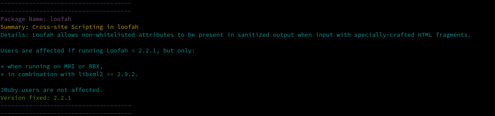

# IronDome

A SCA scanner for ruby applications, read the gemfile.lock verify vulnerabilities use osv database.

## Installation

    $ gem install iron_dome

## Usage

After install the gem just run the follow command on main directory of your application
this directory must have the Gemfile.lock, you can also run on a ci/cd pipeline.

    $ iron_dome

## Output Example

## Supported language and lockfile format

| Ruby      | Gemfile.lock    |
|-----------|-----------------|

## Development

After checking out the repo, run `bin/setup` to install dependencies. Then, run `rake spec` to run the tests. You can also run `bin/console` for an interactive prompt that will allow you to experiment.

To install this gem onto your local machine, run `bundle exec rake install`. To release a new version, update the version number in `version.rb`, and then run `bundle exec rake release`, which will create a git tag for the version, push git commits and the created tag, and push the `.gem` file to [rubygems.org](https://rubygems.org).

## Contributing

Bug reports and pull requests are welcome on GitHub at https://github.com/JAugusto42/iron_dome. This project is intended to be a safe, welcoming space for collaboration, and contributors are expected to adhere to the [code of conduct](https://github.com/[USERNAME]/iron_dome/blob/main/CODE_OF_CONDUCT.md).

## License

The gem is available as open source under the terms of the [MIT License](https://opensource.org/licenses/MIT).

## Code of Conduct

Everyone interacting in the IronDome project's codebases, issue trackers, chat rooms and mailing lists is expected to follow the [code of conduct](https://github.com/[USERNAME]/iron_dome/blob/main/CODE_OF_CONDUCT.md).
